# Antigravity ACP Go Library

A Golang library implementation of the [Agent Client Protocol](https://agentclientprotocol.com) (ACP) server for Google Antigravity's `agy` CLI, written as a pure-Go module.

This library spawns the `agy` CLI, streams its progress live, and replays conversation history on demand. It features a zero-dependency custom Protobuf decoder and uses a Cgo-free SQLite driver (`modernc.org/sqlite`) to make cross-compilation across platforms (macOS, Linux, Windows, arm64, amd64) seamless.

## ⚠️ Terms of Service risk

Google's [Antigravity Terms of Service](https://antigravity.google/terms) state:

> You must not abuse, harm, interfere with, or disrupt the Service. This
> includes, but is not limited to, using the Service in connection with
> products not provided by us. Using third party software, tools, or services
> to access the Service (e.g. using OpenClaw with Antigravity OAuth) is a
> breach of this Agreement. Such actions may be grounds for suspension or
> termination of your account.

`antigravity-acp-go` does not itself request, store, or process any
authentication credentials — it only spawns the official `agy` binary as a
subprocess and talks to it over stdio; all Google OAuth login is handled
entirely by `agy` itself, outside of this project. However, the *effect* is
still a non-Google, ACP-compatible editor driving `agy` (and therefore your
Antigravity account) through a third-party tool — the exact pattern Google's
FAQ names as a Terms of Service violation (Claude Code, OpenClaw, OpenCode,
and by extension this project).

**By using `antigravity-acp-go` with an `agy` session logged into your personal
Antigravity account, you accept the risk that Google may suspend or terminate
that account.** This project is provided as-is, with no warranty, and its
authors and contributors accept no liability for any account action Google
takes as a result of its use. If you want to avoid this risk entirely, Google
recommends authenticating with a Vertex AI or AI Studio API key instead of an
Antigravity OAuth login.

## Installation

```bash
go get github.com/shubzkothekar/antigravity-acp-go
```

## Features

- **Standard ACP Implementation**: Supports `agent/initialize`, `session/new`, `session/load`, `session/resume`, `session/list`, `session/delete`, `session/close`, `session/prompt`, and `session/setConfigOption`.
- **Pure Go Protobuf Decoding**: Custom binary protobuf parser decodes steps payload, error details, permissions request, and task details columns out of SQLite databases with zero dependencies.
- **Asynchronous Loop Ticker**: Runs live database step checks in goroutines, enabling concurrency and immediate processing of client cancels.
- **Auto-Provisioning**: Automatically fetches and verifies SHA-256 signatures of release binaries of the `agy` CLI from GitHub.
- **CamelCase / SnakeCase Normalization**: Handles backwards compatibility for sessions files saved with older schema formats.

## Architecture

At its core, `antigravity-acp-go` is a **translation layer**. On one side it speaks the [Agent Client Protocol](https://agentclientprotocol.com) (JSON-RPC 2.0 over stdio) to an ACP-compatible editor; on the other it drives the official `agy` CLI as a subprocess and observes the results by tailing the SQLite conversation database that `agy` writes to. The `agy` process is treated as an opaque black box — this library never parses its stdout, it reads state exclusively from the on-disk database.

```mermaid
flowchart TB
    Editor["ACP Editor / Client<br/>(Zed, custom app, …)"]

    subgraph lib["antigravity-acp-go"]
        direction TB
        Server["<b>Server</b> (acp.go)<br/>JSON-RPC 2.0 over stdio<br/>request routing + notifications"]
        Agent["<b>AgyAcpAgent</b> (agent.go)<br/>protocol orchestrator<br/>initialize · session · prompt · config"]

        subgraph state["State"]
            direction LR
            Sessions["<b>SessionManager / Store</b><br/>(session.go)<br/>LRU cache + JSON persistence"]
            Replay["<b>ReplayCache</b><br/>(agent.go)<br/>incremental history replay"]
        end

        Adapter["<b>Adapter</b> (adapter.go)<br/>subprocess lifecycle · cancel<br/>200ms DB poll ticker"]

        subgraph decode["DB → ACP Pipeline"]
            direction LR
            DB["<b>ConversationDb</b><br/>(database.go)<br/>read steps table"]
            Proto["<b>Protobuf Decoder</b><br/>(protobuf.go)<br/>zero-dependency parser"]
            Trans["<b>Translator</b><br/>(translator.go)<br/>steps → SessionUpdate"]
        end

        Installer["<b>Installer</b> (installer.go)<br/>fetch + SHA-256 verify agy"]
    end

    Agy["<b>agy CLI</b><br/>(subprocess)"]
    SQLite[("SQLite conversation DB<br/>~/.gemini/…/conversations/*.db")]

    Editor <-->|"JSON-RPC requests /<br/>session/update notifications"| Server
    Server --> Agent
    Agent --> Sessions
    Agent --> Replay
    Agent --> Adapter
    Installer -.->|"provisions binary"| Agy
    Adapter -->|"exec -p prompt"| Agy
    Agy -->|"writes steps"| SQLite
    Adapter -->|"polls"| DB
    Replay --> DB
    DB --> Proto --> Trans
    Trans -->|"streamed updates"| Agent
```



### Request lifecycle

1. **Transport (`acp.go`).** `Server.Run` scans newline-delimited JSON-RPC messages off stdin, dispatching each request in its own goroutine and writing responses/notifications back to stdout via a mutex-guarded `ClientConn`.
2. **Orchestration (`agent.go`).** `AgyAcpAgent` implements the ACP surface — `initialize`, the `session/*` methods, `session/prompt`, and `session/setConfigOption`. It owns session state, advertises available models and permission modes as config options, and injects a planning-mode preamble when the session is in `plan` mode.
3. **Session state (`session.go`).** `SessionManager` keeps a bounded LRU of live sessions in memory, while `SessionStore` persists them to `sessions.json` with atomic writes. A custom `UnmarshalJSON` normalizes older snake_case snapshots to the current camelCase schema.
4. **Execution (`adapter.go`).** For each prompt the `Adapter` spawns `agy -p <prompt>` with the correct `--add-dir`, `--model`, and permission flags, then starts a 200ms ticker that polls the conversation database for new steps. On the first prompt of a new session it diffs a directory snapshot to discover which `*.db` file `agy` created. Client cancels translate to `SIGINT` (or `Kill` on Windows).
5. **Read pipeline (`database.go` → `protobuf.go` → `translator.go`).** New rows from the `steps` table are read through the Cgo-free `modernc.org/sqlite` driver, their protobuf blob columns (`step_payload`, `error_details`, `permissions`, `task_details`) are decoded by the hand-rolled parser, and the `Translator` converts them into ACP `SessionUpdate` notifications (agent message chunks, tool calls, plans, permission requests), optionally filtering `agy`'s "I will…" narration.
6. **Replay vs. stream.** Live prompts run the translator in `ModeStream`; loading historical sessions runs it in `ModeReplay` through the `ReplayCache`, which memoizes decoded updates per conversation and only re-reads the tail of a database that has grown since it was last seen.
7. **Provisioning (`installer.go`).** `EnsureAgy` resolves the right release asset for the host platform, downloads it, verifies its SHA-256 against a pinned table, and extracts the binary — unless `$AGY_BIN` or `$AGY_SKIP_DOWNLOAD` opts out.

## Usage

Here is a simple example showing how to build an ACP server executable using the library:

```go
package main

import (
	"context"
	"log"
	"os"
	"path/filepath"

	antigravityacp "github.com/shubzkothekar/antigravity-acp-go"
)

func main() {
	homeDir, err := os.UserHomeDir()
	if err != nil {
		log.Fatalf("failed to find user home dir: %v", err)
	}

	stateDir := filepath.Join(homeDir, ".agy-acp")
	sessionsFile := filepath.Join(stateDir, "sessions.json")
	store := antigravityacp.NewSessionStore(sessionsFile, stateDir)

	// Resolve or download agy binary path
	destDir := filepath.Join(stateDir, "bin")
	err = antigravityacp.EnsureAgy(antigravityacp.InstallOptions{
		DestDir: destDir,
		Log:     func(msg string) { log.Println(msg) },
		Warn:    func(msg string) { log.Println("WARN:", msg) },
	})
	if err != nil {
		log.Fatalf("failed to ensure agy binary: %v", err)
	}

	// Determine the path of the downloaded executable
	agyBin := filepath.Join(destDir, "agy")
	if os.Getenv("AGY_BIN") != "" {
		agyBin = os.Getenv("AGY_BIN")
	}

	convDir := filepath.Join(homeDir, ".gemini", "antigravity-cli", "conversations")
	if os.Getenv("AGY_CONVERSATIONS_DIR") != "" {
		convDir = os.Getenv("AGY_CONVERSATIONS_DIR")
	}

	agent := antigravityacp.NewAgyAcpAgent(agyBin, convDir, ".", false, "1.0.0", store)
	server := antigravityacp.NewServer(agent)

	log.Println("Starting ACP server on stdin/stdout...")
	if err := server.Run(context.Background(), os.Stdin, os.Stdout); err != nil {
		log.Fatalf("server terminated with error: %v", err)
	}
}
```

### Programmatic API Usage

You can also use the library programmatically in another Go application (without running an ACP JSON-RPC server) by interacting with the `AgyAcpAgent` directly and implementing the `Client` interface to receive streaming updates:

```go
package main

import (
	"fmt"
	"log"

	antigravityacp "github.com/shubzkothekar/antigravity-acp-go"
)

// Implement the Client interface to receive real-time streamed updates
type customClient struct{}

func (c *customClient) Update(sessionID string, update *antigravityacp.SessionUpdate) error {
	// Print only streamed text chunks from the agent in real time
	if update.SessionUpdate == "agent_message_chunk" {
		if content, ok := update.Content.(map[string]interface{}); ok {
			fmt.Print(content["text"])
		}
	}
	return nil
}

func (c *customClient) RequestPermission(params interface{}) (interface{}, error) {
	return nil, nil // Return nil or hook custom interactive prompts here
}

func main() {
	// Initialize store
	store := antigravityacp.NewSessionStore("sessions.json", ".")

	// Instantiating the agent
	agent := antigravityacp.NewAgyAcpAgent("agy", "/path/to/conversations", ".", false, "1.0.0", store)
	client := &customClient{}

	// Start session
	sessionID, _ := agent.NewSession(".", nil, client)
	fmt.Printf("Created session ID: %s\n", sessionID)

	// Run prompt
	fmt.Println("Running prompt...")
	outcome, err := agent.Prompt(sessionID, "List files in the current directory", client)
	if err != nil {
		log.Fatalf("prompt execution failed: %v", err)
	}

	fmt.Printf("\nFinished. Stop reason: %s\n", outcome.StopReason)
}
```

## Running Tests

Run the E2E and unit test suite:

```bash
go test -v ./...
```

## Continuous Integration (CI)

This repository includes a GitHub Actions test workflow under `.github/workflows/go.yml` that automates both unit testing and real `agy` CLI integration testing.

To enable E2E prompt tests with a real `agy` process in CI, you must configure your API credentials using GitHub Secrets:

1. Obtain a Gemini API Key from **Google AI Studio**.
2. In your GitHub Repository, navigate to **Settings > Secrets and variables > Actions**.
3. Create a new Repository Secret named `ANTIGRAVITY_API_KEY` (or `GEMINI_API_KEY`) and set its value to your API key.

The CI environment will automatically inject this secret into the test environment, enabling the E2E `TestRealAgyPrompt` test. Otherwise, the E2E test will be gracefully skipped.

## License

This project is licensed under the [MIT License](LICENSE).

